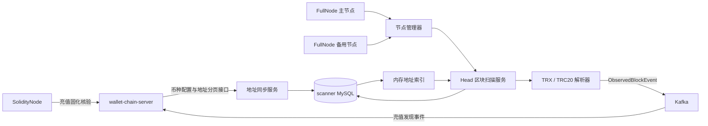

# TRON 扫描器详细设计

## 1. 设计目标

`wallet-tron-scanner` 是独立的 TRON 链数据采集服务，首期负责：

1. 从 `wallet-chain-server` 同步需要永久监控的平台地址。
2. 将地址保存为本地索引并加载到内存，供扫块过程快速匹配。
3. 从 FullNode 按高度顺序扫描最新区块。
4. 解析 TRX 和配置的 TRC20 转账，及时发现进入平台地址的充值。
5. 将充值发现事实可靠发送到 Kafka，由 `wallet-chain-server` 消费并定时确认是否已经固化。
6. 持久化扫描进度，服务重启后从上次成功位置继续。

设计优先保证不漏单、可重放和边界清晰。充值发现使用现有 Kafka；Scanner 不额外引入 Outbox、Redis 或完整区块索引。

---

## 2. 核心结论

### 2.1 服务独立

扫描器继续作为独立服务部署，不合并进 `wallet-chain-server`。TRON SDK、节点连接、区块轮询和链特有解析都留在本项目中。

以后增加其他链时，新增对应扫描器，例如：

```text
wallet-tron-scanner
wallet-evm-scanner
wallet-bitcoin-scanner
```

`wallet-chain-server` 保持统一的链业务模型，不承载某条链的扫块线程。

### 2.2 数据库独立

扫描器拥有自己的 MySQL schema。它可以与链服务共用同一个 AWS RDS 实例，但必须使用独立 schema 和账号。

扫描器不直接连接 `wallet-chain-server` 数据库。地址和币种配置通过内部接口同步，充值事实通过 Kafka 发送。

### 2.3 数据库是本地索引

扫描器数据库只保存：

- 已同步的监控地址副本。
- 地址同步游标。
- Head 区块扫描游标和最近 2 万条连续区块摘要。

平台地址、地址绑定、充值单、提现单、归集单仍由 `wallet-chain-server` 管理。扫描器本地数据丢失后可以通过链服务和链节点重建。

---

## 3. 总体架构



### 3.1 `wallet-chain-server` 职责

- 管理 `chain_currency_config`。
- 管理 `chain_address` 及地址状态。
- 提供币种配置和地址增量同步接口。
- 接收地址监控 ACK，将 `PENDING_MONITOR` 推进为 `ACTIVE`。
- 消费充值发现事件，幂等写入 `chain_deposit`。
- 定时查询 SolidityNode，核验 `CONFIRMING` 充值并推进为 `CONFIRMED` 或 `ORPHANED`。
- 根据地址和绑定关系确定充值所属用户。
- 通知出入金服务处理充值业务。

### 3.2 `wallet-tron-scanner` 职责

- 保存监控地址本地副本。
- 维护可并发查询的内存地址索引。
- 管理 TRON 节点连接和节点切换。
- 顺序扫描 Head 区块并记录扫描高度。
- 保存最近区块摘要；发现分叉后通过 FullNode 二分查找最近的共同区块。
- 解析 TRX 和 TRC20 Transfer 事件。
- 仅发送与平台地址有关的链上事实。
- 在 Kafka Broker ACK 成功后推进扫描游标。

### 3.3 明确禁止

- 不保存 `key_ref`、私钥、种子或签名材料。
- 不保存用户账户余额和账务流水。
- 不直接修改 `chain_address`、`chain_deposit` 等链服务业务表。
- 不逐笔远程查询某个地址是否属于平台。
- 不在异步解析尚未完成时提前推进区块游标。

---

## 4. 本地数据库设计

首期保存监控地址、Head 检查点和分叉恢复摘要三张表。

### 4.1 `tron_monitor_address`

保存从链服务同步过来的永久监控地址。

```sql
CREATE TABLE `tron_monitor_address` (
    `source_address_id` BIGINT NOT NULL COMMENT 'wallet-chain-server 中 chain_address.id，也是地址增量同步游标',
    `chain_network` VARCHAR(32) CHARACTER SET ascii COLLATE ascii_bin NOT NULL COMMENT 'TRON网络，例如MAINNET、NILE',
    `address` VARCHAR(64) CHARACTER SET ascii COLLATE ascii_bin NOT NULL COMMENT 'Base58Check格式TRON地址',
    `address_purpose` VARCHAR(32) CHARACTER SET ascii COLLATE ascii_bin NOT NULL COMMENT '地址用途：DEPOSIT、HOT、RESOURCE',
    `created_at` DATETIME(3) NOT NULL DEFAULT CURRENT_TIMESTAMP(3) COMMENT '同步到扫描器的时间，UTC',
    PRIMARY KEY (`source_address_id`),
    UNIQUE KEY `uk_tron_monitor_address` (`chain_network`, `address`),
    KEY `idx_tron_monitor_address_sync` (`chain_network`, `source_address_id`)
) ENGINE=InnoDB DEFAULT CHARSET=utf8mb4 COLLATE=utf8mb4_unicode_ci COMMENT='TRON扫描器监控地址本地索引';
```

设计说明：

- `source_address_id` 直接使用 `chain_address.id`，同时作为增量同步游标。
- 不保存用户 ID、绑定关系和 `key_ref`。
- 不保存分配状态和地址状态。平台生成过的地址即使被禁用或换出，也必须永久监控。
- `address_purpose` 用于区分客户充值、平台热钱包和资源钱包，避免把平台内部资金移动当成客户充值。

### 4.2 `tron_scan_checkpoint`

保存每个网络最后完整处理的 Head 高度和 Hash。

```sql
CREATE TABLE `tron_scan_checkpoint` (
    `chain_network` VARCHAR(32) CHARACTER SET ascii COLLATE ascii_bin NOT NULL COMMENT 'TRON网络，例如MAINNET、NILE',
    `last_block_number` BIGINT NOT NULL COMMENT '最后完整解析并成功上报的Head区块高度',
    `last_block_hash` VARCHAR(128) CHARACTER SET ascii COLLATE ascii_bin NOT NULL COMMENT '最后完整处理的Head区块Hash',
    `updated_at` DATETIME(3) NOT NULL DEFAULT CURRENT_TIMESTAMP(3) ON UPDATE CURRENT_TIMESTAMP(3) COMMENT '最近扫描进度变更时间，UTC',
    PRIMARY KEY (`chain_network`)
) ENGINE=InnoDB DEFAULT CHARSET=utf8mb4 COLLATE=utf8mb4_unicode_ci COMMENT='TRON Head扫块检查点';
```

地址同步水位不再写入检查点表。scanner 从 `tron_monitor_address` 按当前网络查询最大的 `source_address_id`，在本地地址全部加载到内存后将该值作为 ACK 水位。

Scanner 只部署一个实例、一个扫块任务，XXL-JOB 配置单机串行。检查点按网络直接更新，高度与 Hash 在同一条 SQL 中修改；摘要写入和检查点更新放在一个手动事务中。

### 4.3 `tron_scanned_block`

保存每个网络实际处理的区块高度和 Hash，默认连续保留最近 2 万条。更早记录批量清理，分叉时在保留记录中查找共同区块。

| 字段 | 类型 | 说明 |
|---|---|---|
| `chain_network` | `VARCHAR(32)` | 所属网络 |
| `block_number` | `BIGINT` | 已处理高度；创世前边界允许为 -1 |
| `block_hash` | `VARCHAR(128)` | 当时实际处理的 Hash；高度 -1 时为空字符串 |

主键为 `(chain_network, block_number)`。Mapper 继承 `BaseMapper`，查询与清理条件统一写在数据库 Service 的 Lambda 中；所有条件操作都限定网络，按单个区块查询时同时限定高度，不使用单 ID 方法。

最小高度仅是历史查找下界，不代表固化或安全点。每次区块处理成功后，摘要与检查点一起提交；高度为 100 的整数倍时，在同一事务中清理旧摘要，两次清理之间最多暂时多保留 99 条连续摘要。分叉回退与旧分支摘要删除一起提交。完整流程见[阶段 6 第 9 节](阶段6-充值发现闭环设计.md#9-区块连续性与分叉回退)。


---

## 5. 地址内存索引

### 5.1 保存内容

内存只保存：

```text
TRON address → addressPurpose
```

不将数据库实体、用户绑定或币种配置一起塞入地址集合。

### 5.2 数据结构

使用线程安全 Map：

```java
ConcurrentHashMap<String, AddressPurpose>
```

地址只新增、不删除，因此增量同步可以使用 `putIfAbsent`，不需要每同步一页就复制完整的百万地址 Map。

服务启动时从本地表构建一个新 Map，完整加载成功后再一次性替换当前引用。扫块任务只有在地址快照完成初始化后才能进入就绪状态。

### 5.3 查询规则

- 扫块过程先根据收款地址查询内存。
- 未命中直接忽略，不访问数据库和链服务。
- 命中后将地址和链上事实提交给 `wallet-chain-server`。
- 链服务负责再次核对地址、币种配置和用户绑定。

---

## 6. 地址同步设计


配套说明见 [地址同步闭环图解](学习笔记/01-地址同步闭环图解.md)。

### 6.1 链服务接口

建议在 `chain-client` 定义三个内部契约。

#### 查询扫描币种配置

```text
GET /chain/scanner/currencies?chainCode=TRON
```

请求只包含 `chainCode`，响应只包含扫描需要的 `currency`、`tokenStandard`、`contractAddress` 和 `decimals`。

#### 分页同步地址

```text
GET /chain/scanner/addresses?chainCode=TRON&afterId=0
```

分页大小由链服务固定为 1000 条。每个地址只返回 `addressId`、`address` 和 `addressPurpose`。响应按 `addressId` 升序，额外返回 `maxAddressId` 和 `hasMore`。

#### 确认监控水位

```text
POST /chain/scanner/addresses/ack
```

请求包含 `chainCode` 和 `appliedMaxAddressId`。链服务只更新该链中满足以下条件的地址：

```text
id <= appliedMaxAddressId
address_status = PENDING_MONITOR
```

### 6.2 启动流程

```text
读取 tron_monitor_address
→ 构建完整内存地址索引
→ 查询当前网络最大的 source_address_id
→ 将其设为内存 appliedMaxAddressId
→ 从 appliedMaxAddressId 继续分页同步新地址
→ 有增量时应用并 ACK 新水位；无增量时重试 ACK 当前水位
→ 地址同步完成
→ scanner readiness = READY
→ 允许 Head 区块扫描任务执行
```

只有本地地址全部加载到内存后，数据库最大 `source_address_id` 才能成为安全应用水位。启动后的首次同步会从该水位继续拉取；没有新增地址时重复 ACK 当前水位，有新增地址时 ACK 新水位，从而恢复“地址已经应用成功，但上一次 ACK 响应丢失”的情况。

### 6.3 单页同步顺序

```text
1. 查询 addressId > 当前 appliedMaxAddressId 的一页地址
2. 校验网络、地址格式、用途以及页内重复项
3. 本地事务批量插入 tron_monitor_address
4. 将本页全部地址加入内存索引
5. 将本页最大 addressId 设为新的 appliedMaxAddressId
6. ACK 新应用水位给 wallet-chain-server
7. 继续下一页
```

第 3 步重复插入时必须核对已有记录：

- 地址 ID、网络、地址和用途完全一致：视为幂等成功。
- 相同 ID 对应不同地址，或相同地址对应不同 ID：停止同步并告警。

### 6.4 故障恢复

| 失败位置 | 恢复结果 |
| --- | --- |
| 本地地址写入前停止 | 应用水位不变，下次重新拉取 |
| 地址写入后、内存完整更新前停止 | 进入未就绪状态，从本地表重建内存索引；重建完成前不 ACK、不扫块 |
| 内存更新后、应用水位更新前停止 | 下次重复拉取，数据库核对与内存写入均保持幂等 |
| 应用水位更新后、ACK 前停止 | 下次任务重复 ACK 当前内存应用水位 |
| ACK 成功但响应丢失 | 重复 ACK，链服务状态不会回退 |

---

## 7. Head 扫块与固化确认

产品需要展示“充值中”，因此充值处理分为发现和确认两个阶段：

```text
scanner 扫描 FullNode Head 区块
→ 发现平台地址充值
→ chain-server 创建 CONFIRMING、版本1和待通知标记
→ 链服务统一通知任务发送当前状态，出入金服务展示充值中
→ chain-server 确认任务读取 TRON 最新固化高度
→ 通过 SolidityNode 核验原交易和事件
→ 更新为 CONFIRMED 或 ORPHANED，版本加1并登记待通知
→ 同一个通知任务发送当前版本，出入金服务按版本更新订单
```

scanner 负责及时发现链上事实，`wallet-chain-server` 负责推进充值业务状态。

出入金服务消费chain-server的标准状态消息，不直接消费Scanner原始消息。同步最新状态，不要求每次中间变化单独送达；快速固化时可以直接通知成功，下游根据完整消息创建订单。

### 7.1 两类高度

系统会同时使用两个高度，但含义不同：

| 高度 | 所属位置 | 作用 |
| --- | --- | --- |
| `HEAD_BLOCK` | scanner 的 `tron_scan_checkpoint` | 已经完整扫描并成功上报的最新 Head 区块 |
| 最新固化高度 | chain-server 从 SolidityNode 查询 | 判断 `CONFIRMING` 充值是否具备核验条件 |

最新固化高度是 TRON 网络水位，不是 scanner 的第二个顺序扫块游标，因此首期不需要 `CONFIRMED_BLOCK` 检查点。

### 7.2 scanner 首次启动高度

当数据库不存在 `HEAD_BLOCK` 检查点时，必须使用部署时明确给出的 `start-block-height`，并从该高度开始扫描。

生产环境不能静默使用当前最新高度，否则配置错误可能跳过应扫描区块；也不能默认从创世块开始，避免无意义地扫描全部历史。

初始化时读取 FullNode 的起点前一区块，保存检查点和初始摘要；起点为 0 时用 -1 哨兵，不必等待固化。后续启动检查配套摘要和末块 Hash，再继续扫描。分叉时在保留历史中查找最近共同区块。近期摘要按准确高度读取，缺少记录时结束本轮并报错。

### 7.3 scanner 单区块处理顺序

```text
读取本地 HEAD_BLOCK 高度 H
→ 核对已扫描末块 Hash
→ 查询 FullNode 最新 Head 高度 T
→ 如果 H >= T，本轮顺序扫描结束
→ 获取 H + 1 区块
→ 校验区块高度、Hash 和时间
→ 校验 parentBlockId 等于检查点的 lastBlockHash
→ 不一致时二分查找最近共同区块并回退，下轮从该点后一块重扫
→ 等待区块内全部交易解析完成
→ 提取进入平台地址的 TRX/TRC20 事件
→ 有充值事件时向 Kafka 发送区块充值事件
→ Kafka Broker ACK 成功
→ 在一个手动短事务中保存摘要、更新扫描检查点为 H + 1；整百高度同时清理旧摘要
→ 继续处理下一块
```

没有命中平台地址的区块不发送 Kafka，仍需原子保存摘要和本地游标。区块内交易可以在内存中并行解析，但必须等待所有任务完成并汇总结果，禁止把任务丢进线程池后直接推进区块高度。

### 7.4 区块连续性与共同区块查找

1. 每轮比较末块 Hash：相同就正常扫描，不同就处理分叉。
2. 每块检查高度和父 Hash，发现本轮内发生的分叉；接不上就走同一个分叉处理流程。
3. 分叉时固定一个 FullNode，在保留摘要中二分查找并复核最后相同的区块。
4. 一个手动事务更新检查点、删除共同区块之后的摘要；本轮结束，下轮从下一块重扫。
5. 找不到共同区块时明确报错，保持原进度和摘要；不能跳到最新高度或猜测回退位置。
6. 默认保留最近 20000 条摘要，每 100 个高度清理一次，与该块的进度提交在同一事务中。

Scanner 只使用 FullNode 完成扫块与分叉恢复。chain-server 独立核验充值固化结果，Scanner 不推进充值确认状态。
节点落后、超时或空响应不能当作 Hash 不同。查找中节点读取失败或分支变化，结束本轮，下轮重试。

代码从 `HeadBlockScanService.scanBlocks()` 开始：`checkResult.fork()` 为 true 时调用 `handleFork()`；否则进入 `scanNewBlocks()`。
单实例、单任务、单机串行；进度服务直接执行数据库操作，没有显式行锁或并发抢占逻辑。

详细例子、事务边界与建表说明见[阶段 6 设计](阶段6-充值发现闭环设计.md#9-区块连续性与分叉回退)。

### 7.5 chain-server 固化确认任务

详细核验规则、失效复查与当前状态通知实施计划见 [阶段 7 充值固化确认闭环设计](../../wallet-chain-server/docs/阶段7-充值固化确认闭环设计.md)。本阶段实现在 chain-server，Scanner 继续负责发现与分叉重扫。

`DepositConfirmationJob` 定时执行：

```text
从 SolidityNode 查询最新固化高度 S
→ 分页查询 block_number <= S 的 CONFIRMING 充值
→ 按 txId 查询 SolidityNode 固化交易和回执
→ 核对执行结果、区块位置、合约、eventIndex、收款地址和 rawAmount
   ├─ 完全一致：CONFIRMING → CONFIRMED
   ├─ 明确位于失效分叉：CONFIRMING → ORPHANED
   └─ 节点超时或结果不明确：保持 CONFIRMING，下次重试
→ 状态、版本递增和待通知标记同一次更新，通知任务获得 Kafka ACK 后匹配发送时版本标记已发送
```

不能只使用 `block_number <= S` 就确认到账。固化高度只表示可以开始核验，最终还要通过 SolidityNode 确认原 `txId`、交易成功结果和对应转账事件确实存在。

一次查询不到交易不能直接更新为 `ORPHANED`。只有健康 SolidityNode 明确返回原区块或交易已经不在固化链上时才能判定失效；连接失败、限流和超时都继续等待。

`ORPHANED` 表示原充值事实失效，可以恢复为更高版本的确认中或已确认。节点超时不发送充值失败；下游不能让旧版本的失效通知覆盖新版本成功状态。

### 7.6 每轮扫描上限

每次 scanner Job 最多顺序处理 `max-blocks-per-run` 个新区块，默认建议 100。达到上限后正常结束，由下一次任务继续。

chain-server 确认任务也按 ID 分页处理 `CONFIRMING` 记录，避免单次任务长时间持有数据库连接和事务。

---

## 8. TRX 与 TRC20 解析

### 8.1 TRX

处理 `TransferContract`，读取付款地址、收款地址和 SUN 整数金额。只有收款地址存在于内存监控集合时才生成链上事件。

原生 TRX 固定使用负数事件序号：

```text
eventIndex = -1
```

当前 TRON 协议只支持一笔交易包含一个 Contract；字段定义为列表是为协议后续扩展。Scanner 遇到多个 Contract 时拒绝解析。

### 8.2 TRC20

处理 `TriggerSmartContract` 对应交易回执中的 `Transfer(address,address,uint256)` 日志：

1. 交易执行结果必须成功。
2. 日志合约地址必须存在于当前扫描币种配置中。
3. 解析 `from`、`to` 和原始整数金额。
4. `to` 必须命中内存地址索引。
5. `eventIndex` 使用交易回执中的日志序号，从 0 开始。

TRX 使用负数、TRC20 日志使用非负数，可以保证同一交易内事件序号不冲突，并与链服务现有唯一键兼容。

### 8.3 上报模型

每条充值事实至少包含：

| 字段 | 说明 |
| --- | --- |
| `chainCode` | 固定 `TRON` |
| `currency` | `TRX` 或 `USDT` |
| `contractAddress` | TRX 为空，TRC20 为合约地址 |
| `txId` | 链上交易 ID |
| `eventIndex` | 稳定事件序号 |
| `blockNumber` | 发现交易时所在区块高度 |
| `blockHash` | 发现交易时所在区块 Hash |
| `blockTimestamp` | 链上时间 |
| `fromAddress` | 付款地址 |
| `toAddress` | 平台收款地址 |
| `rawAmount` | 链上最小单位整数金额 |

scanner 不换算展示金额。`wallet-chain-server` 根据币种配置中的 `decimals` 处理业务金额。

---

## 9. 充值发现 Kafka 事件

scanner 按区块发送充值发现事件：

```text
Topic: wallet.chain.deposit.discovered
Key:   chainCode
Value: ObservedBlockEvent
```

事件契约定义在 `chain-client`。`ObservedBlockEvent` 保存链编码、区块高度、当前区块 Hash、父区块 Hash、区块时间和本区块充值事实列表。每条 `DepositDiscoveryEvent` 保存币种、合约地址、`txId + eventIndex`、付款地址、收款地址和 `rawAmount`。

链服务消费消息时：

1. 校验链编码和区块字段。
2. 根据 `currency + contractAddress` 找到 `chain_currency_config`。
3. 根据 `toAddress` 找到 `chain_address`。
4. 识别并排除可以匹配到平台业务单的内部资金移动。
5. 使用 `(chain_code, tx_id, event_index)` 幂等写入 `chain_deposit`，初始状态为 `CONFIRMING`。
6. 同一消息中的事件全部处理成功后提交 Kafka 消费位点。

scanner 只有收到 Kafka Broker ACK 后才推进本地区块检查点。发送失败时保留原检查点并重新扫描；发送成功但检查点更新失败时允许重复发送，由链服务幂等去重。没有命中平台地址的空区块不发送消息，可以直接推进本地检查点。

固化确认不由 scanner 重复上报区块完成。`wallet-chain-server` 的 `DepositConfirmationJob` 主动查询 SolidityNode，核验成功后推进为 `CONFIRMED` 并通知出入金服务充值到账。

---

## 10. 节点管理与切换

节点 HTTP 接口、角色、超时、返回模型和错误分类以 [阶段4：TRON节点能力契约](阶段4-TRON节点能力契约.md) 为准。

### 10.1 配置

scanner 至少配置一个 FullNode，生产建议配置主备节点，用于 Head 扫描与共同区块查找；SolidityNode 不再是 Scanner 必需配置。`wallet-chain-server` 的确认任务也通过链节点适配器访问 SolidityNode。节点地址和凭证放在 Nacos 或环境变量，不写数据库。

### 10.2 健康检查

节点管理器定时采集：

- 是否可以连接。
- 最新 Head 高度。
- 最新固化高度。
- 最近响应耗时。
- 最近成功时间。
- 是否落后健康节点超过允许高度。

### 10.3 选择策略

- 正常情况下持续使用当前主节点，不按请求随机选择。
- 当前节点不可用、连续失败或高度明显落后时切换备用节点。
- 节点恢复后不立即抢回，避免频繁抖动。
- 所有候选节点启动时必须通过网络校验。
- 新 FullNode 的 Head 高度低于本地 `HEAD_BLOCK` 检查点时不能用于当前扫描。

节点运行状态保存在内存即可。首期不建立节点状态表。

---

## 11. 幂等、并发与恢复

### 11.1 幂等边界

| 场景 | 幂等依据 |
| --- | --- |
| 地址同步 | `source_address_id` 和网络地址唯一键 |
| 地址 ACK | `appliedMaxAddressId` 水位，只允许向前 |
| 区块扫描 | 单线程写入扫描检查点 |
| 充值上报 | `chain_code + tx_id + event_index` |

### 11.2 多实例

首期由 XXL-JOB 固定一个执行器串行触发地址同步和扫块任务。

数据库检查点仍使用比较并更新，防止发布、手工触发或配置错误导致两个任务同时推进。即使两个实例重复提交充值，链服务唯一键仍会收敛到同一条记录。

### 11.3 故障处理

| 故障 | 处理方式 |
| --- | --- |
| 节点查询失败 | 不推进游标，切换节点或下轮重试 |
| 区块字段不合法 | 不推进游标，告警并停止本轮 |
| 某笔交易解析失败 | 整块失败，不推进游标 |
| 链服务不可用 | 不推进游标，下轮重新提交整块 |
| 链服务成功但响应丢失 | 重复提交，链服务幂等返回 |
| 本地检查点更新失败 | 下轮重复解析和提交该块 |
| scanner 数据库丢失 | 恢复备份，或从明确安全高度重放；链服务幂等去重 |

---

## 12. 配置设计

建议的最小配置：

```yaml
nb:
  tron:
    scanner:
      chain-network: ${TRON_NETWORK:MAINNET}
      chain-service-url: ${CHAIN_SERVICE_URL:http://127.0.0.1:8080}
      start-block-height: ${TRON_SCAN_START_BLOCK_HEIGHT}
      max-blocks-per-run: 100
      expected-genesis-block-id: ${TRON_GENESIS_BLOCK_ID}
      node:
        connect-timeout: 3s
        read-timeout: 10s
        max-response-size: 16MB
        health-check-interval: 15s
        failure-threshold: 3
        height-lag-threshold: 20
        recovery-cooldown: 60s
        nodes:
          - code: full-primary
            role: FULL_NODE
            priority: 1
            base-url: ${TRON_FULL_NODE_PRIMARY_URL:}
            api-key: ${TRON_FULL_NODE_PRIMARY_API_KEY:}
          - code: full-backup
            role: FULL_NODE
            priority: 2
            base-url: ${TRON_FULL_NODE_BACKUP_URL:}
            api-key: ${TRON_FULL_NODE_BACKUP_API_KEY:}
          - code: solidity-primary
            role: SOLIDITY_NODE
            priority: 1
            base-url: ${TRON_SOLIDITY_NODE_URL:}
            api-key: ${TRON_SOLIDITY_NODE_API_KEY:}
```

`start-block-height`、创世区块 ID 和节点地址在生产环境必须提供。地址分页大小由链服务固定，单轮区块上限提供默认值。节点配置字段的最终含义以阶段 4 契约为准。

---

## 13. 代码结构

保持单模块工程，建议增加 `repository` 和按职责拆分的子包：

```text
com.nb.tron.scanner
├── client
│   ├── chainserver    币种和地址同步客户端
│   └── tron           FullNode 与 SolidityNode 客户端
├── config             运行参数和自动配置
├── job
│   ├── AddressSyncJob
│   └── HeadBlockScanJob
├── model
│   ├── address
│   ├── block
│   └── deposit
├── repository         本地地址索引和检查点数据库操作
└── service
    ├── address        地址同步与内存索引
    ├── node           节点健康检查与选择
    ├── parser         TRX/TRC20 解析
    ├── publisher      充值发现 Kafka 发送
    └── scan           Head 区块扫描编排
```

Job 只负责触发和记录执行结果，业务流程放在 Service。节点 SDK 对象和 Feign DTO 不进入核心解析模型。

---

## 14. 可观测性

至少提供以下指标：

| 指标 | 作用 |
| --- | --- |
| 本地监控地址数量 | 判断地址同步是否完整 |
| 地址同步游标 | 与链服务最大地址 ID 对比 |
| 当前 Head 扫描高度 | scanner 当前处理位置 |
| FullNode 最新 Head 高度 | 与本地检查点比较，计算扫描延迟 |
| 扫描高度差 | 主要告警指标 |
| 最近成功扫块时间 | 判断任务是否卡住 |
| 每区块解析交易数和命中数 | 观察解析结果 |
| 节点可用数量和响应耗时 | 判断节点质量 |
| Kafka 发送失败次数 | 判断充值事件投递异常 |

日志必须包含网络、区块高度、区块 Hash、交易 ID 和 traceId。不得记录节点密钥、API Key 或未脱敏的第三方响应。

---

## 15. 实施顺序

### 阶段一：本地持久化基础

1. 引入 `nb-mybatis-starter` 和 MySQL 驱动。
2. 固化地址和检查点 DDL；阶段 6.5 增加区块摘要表。
3. 编写实体、Mapper、Service 和检查点更新。

### 阶段二：地址同步闭环

1. 在 `chain-client` 定义币种、地址分页和 ACK 契约。
2. 在 `wallet-chain-server` 实现内部接口。
3. 实现 scanner 本地地址仓库和内存索引。
4. 实现启动加载、分页同步、内存应用水位和 ACK。
5. 完成故障恢复与百万地址内存测试。

### 阶段三：节点能力

1. 接入 java-tron 原生 HTTP API，不引入 Trident、gRPC 或 JSON-RPC。
2. 实现节点网络校验、健康检查和主备切换。
3. 完成 Head 高度、固化高度和按高度取块能力。

### 阶段四：区块解析

1. 实现 TRX 解析器。
2. 实现 TRC20 Transfer 日志解析器。
3. 实现币种配置内存快照。
4. 完成真实 Head 区块和固化回执样本测试。

### 阶段五：充值闭环

1. 定义 Head 区块充值发现 Kafka 事件契约。
2. 在链服务实现幂等创建 `CONFIRMING` 充值记录。
3. 实现 Head 扫描编排、摘要与检查点原子提交、二分查找共同区块和分叉重扫。
4. 在链服务实现固化高度查询、交易核验和确认任务。
5. 验证节点失败、分叉替换、上报超时、服务重启和重复区块。

---

## 16. 验收标准

1. scanner 重启后不需要从头同步地址或重新扫描全部区块。
2. 地址写入本地、加载内存、推进游标和 ACK 任一步骤失败都不会提前激活未监控地址。
3. 同一区块重复扫描和重复提交不会生成重复充值。
4. 任意一笔交易解析失败时不会越过该区块。
5. 链服务停机恢复后，scanner 可以从原区块继续提交。
6. 主节点故障后能够切换至同网络、未落后的备用节点。
7. 扫块过程中不逐笔查询数据库判断地址归属。
8. scanner 数据库不包含用户绑定、私钥、`key_ref` 和账户余额。
9. 100 万地址规模下，地址查询保持常数时间，并给出实际堆内存压测结果。
10. 扫描高度差、地址同步水位和节点健康均可监控和告警。
11. Head 发现后能够生成 `CONFIRMING` 充值，固化核验后只能推进为 `CONFIRMED` 或 `ORPHANED`。

---

## 17. 首期不实现

- Pending Pool 中尚未入块的交易扫描。
- Kafka 或 TRON Event Plugin 订阅。
- scanner Outbox 和本地充值订单表。
- Redis 或 Bloom Filter 地址匹配。
- 全量区块、交易和回执归档。
- 节点状态持久化。
- 多实例主动抢占和复杂分布式锁。

这些能力只有在产品时效、吞吐或容灾指标明确要求时再增加。

---

## 18. 参考依据

- [TRON Exchange Wallet Integration](https://developers.tron.network/docs/exchangewallet-integrate-with-the-tron-network)：交易所和托管钱包按高度扫描固化区块。
- [TRON API Reference](https://developers.tron.network/docs/api)：SolidityNode 用于固化状态读取，扫描器维护本地索引数据库。
- [TRON Event Plugin](https://github.com/tronprotocol/event-plugin)：后续需要事件订阅时的官方扩展方案。
- [Trezor Blockbook](https://github.com/trezor/blockbook)：独立索引器使用本地持久化索引的成熟实践。


---

## 19. TRON SDK接入

节点HTTP访问、协议模型、地址转换和完整转账解析集中在同级项目 `wallet-tron-sdk`。

1. `TronHttpConfiguration`直接装配SDK的`TronNodeClient`、`TronAddressCodec`和`TronBlockParser`；客户端复用应用HttpClient和ObjectMapper，内部创建传输层。
2. `TronNodeManager`管理节点健康、主备选择和扫描统计，使用SDK读取完整区块。
3. `biz.DepositDiscoveryService`将以`TronAsset`为键的不可变币种快照交给SDK，得到标准转账后匹配平台充值地址并组装业务事件；每轮共用同一份快照。
4. `HeadBlockScanService`继续负责扫块编排、Kafka ACK、进度与摘要保存及分叉恢复。
5. 原Scanner的同名客户端、地址转换器和`parser`包已迁入SDK，协议解析不再分散维护。
6. 默认依赖JAR，源码联调显式启用 `-PuseLocalTronSdk=true`。

完整入口和调用示例见[SDK说明](../../wallet-tron-sdk/README.md)。
