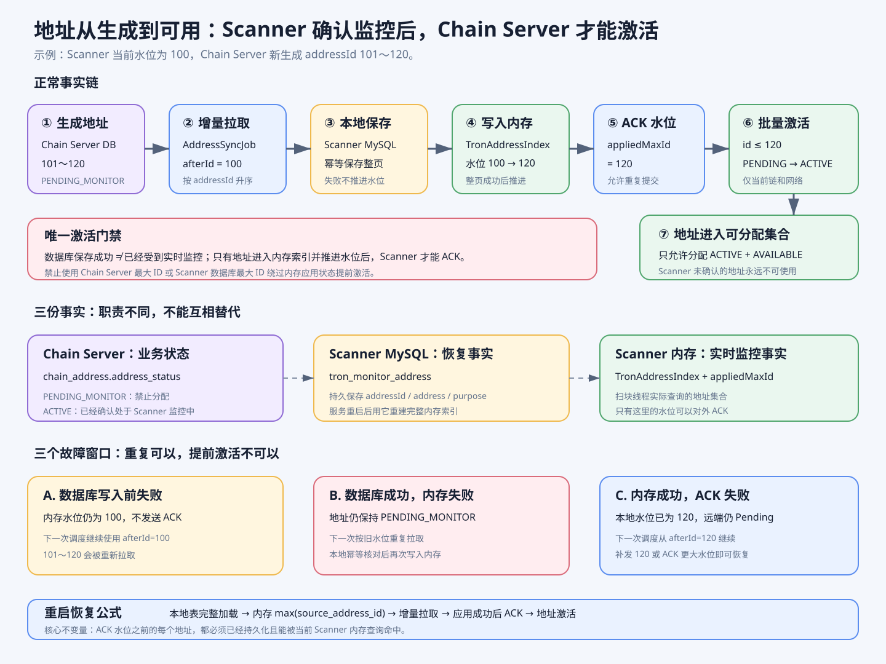

# 地址同步闭环图解

这张图回答一个核心问题：`wallet-chain-server` 新生成的地址，经过哪些步骤后才能安全提供给业务使用。



## 一、正常地址闭环

以 Chain Server 新生成 `addressId=101～120` 的一批地址为例：

1. Chain Server 将地址写入 `chain_address`，初始状态为 `PENDING_MONITOR`。
2. `AddressSyncJob` 使用 Scanner 当前内存水位 `afterId=100` 拉取增量。
3. Scanner 将地址幂等保存到本地 `tron_monitor_address`。
4. 当前页全部保存成功后，地址才会加入 `TronAddressIndex`，内存水位推进到 `120`。
5. Scanner 向 Chain Server ACK `appliedMaxAddressId=120`。
6. Chain Server 只把当前网络下 `id <= 120` 且状态为 `PENDING_MONITOR` 的地址更新为 `ACTIVE`。
7. 地址池只能分配 `ACTIVE + AVAILABLE` 的充值地址。

因此，数据库写入成功不等于地址已经可用；只有 Scanner 确认地址已进入内存监控集合后，Chain Server 才能激活地址。

## 二、三份事实分别代表什么

- `chain_address.address_status`：决定地址能否被业务分配。
- `tron_monitor_address`：Scanner 重启后可以恢复的本地持久化事实。
- `TronAddressIndex.appliedMaxAddressId`：当前进程已经能够实时识别的最大地址水位。

ACK 只能使用内存已经生效的水位，不能直接使用 Chain Server 最大 ID，也不能只根据 Scanner 数据库最大 ID 提前确认。

## 三、失败如何恢复

- 数据库写入前失败：本地水位不变，下一次调度重新拉取。
- 数据库成功、内存失败：Chain Server 地址仍为 `PENDING_MONITOR`；下一次同步按旧内存水位重复拉取，本地保存保持幂等，再写入内存。
- 内存成功、ACK 失败：内存水位已经推进；下一次调度从新水位继续，并补发当前水位或更大水位 ACK。
- 服务重启：先从 `tron_monitor_address` 重建完整内存索引，再从恢复出的最大 `source_address_id` 继续同步。

## 四、必须守住的安全规则

```text
没有进入 Scanner 内存索引
        ↓
不能 ACK
        ↓
不能从 PENDING_MONITOR 变成 ACTIVE
        ↓
不能分配给用户
```

重复拉取、重复保存和重复 ACK 都允许；提前激活地址不允许。
