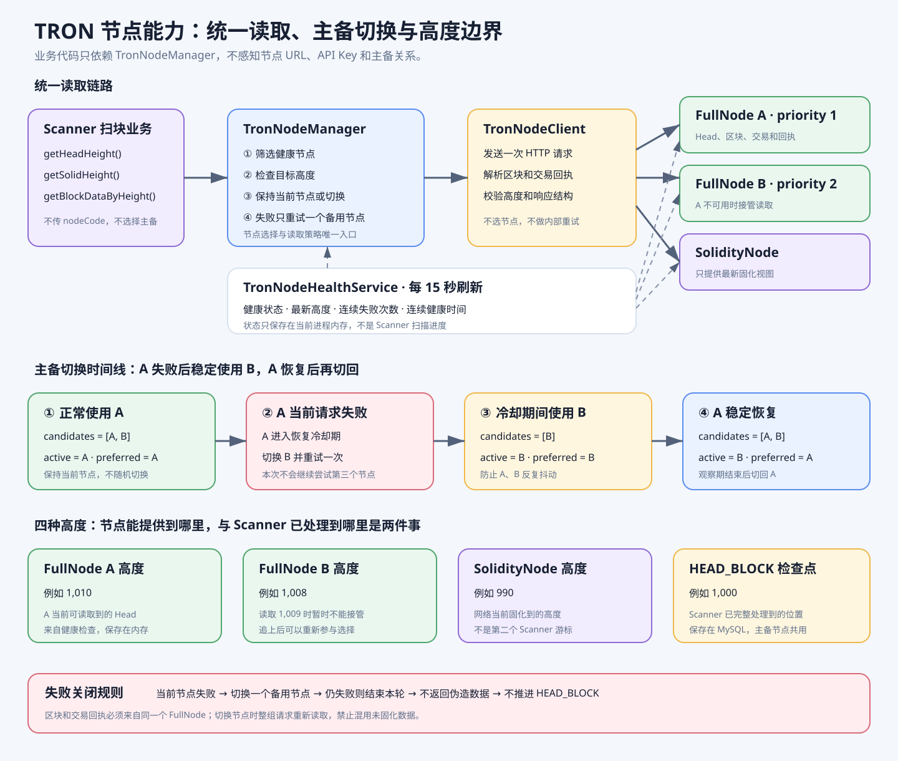

# TRON 节点能力图解

这张图回答一个核心问题：Scanner 如何在不感知节点 URL 和主备关系的情况下，稳定读取 Head 区块、固化高度和交易回执。



## 一、三个组件分别负责什么

- `TronNodeHealthService`：每 15 秒检查全部配置节点，记录健康状态、节点最新高度、连续失败次数和恢复时间。
- `TronNodeManager`：根据节点角色、健康状态、高度和优先级选择节点；当前请求失败时只切换一个备用节点重试一次。
- `TronNodeClient`：向已经选定的节点发送一次 HTTP 请求，解析并校验响应；不选择节点，也不重试。

业务代码只调用 `TronNodeManager`：

```text
getHeadHeight()                  查询最新 Head 高度
getSolidHeight()                 可选固化高度能力，Head 扫描不使用
openBlockHeaderReader(height)    为共同区块查找固定一个 FullNode
getBlockDataByHeight(height)     读取指定高度的区块、交易和回执
```

## 二、FullNode 和 SolidityNode 的职责

### FullNode

- 查询最新 Head 高度。
- 按高度读取区块和交易。
- 从同一个节点读取对应交易回执。
- 用于及时发现充值，但 Head 区块不能直接作为最终到账依据。

### SolidityNode

- 查询最新固化高度。
- 保留为可选节点能力；Scanner 的 Head 扫描与分叉回退不依赖它。
- 不替代 FullNode 扫描 Head，也不负责推进充值到账状态。

## 三、主备切换时间线

假设 FullNode A 的优先级为 1，FullNode B 的优先级为 2：

1. 正常状态：A、B 都健康，持续使用 A。
2. A 当前请求失败：A 进入冷却期，本次调用切换 B 并重试一次。
3. A 仍在冷却期：后续请求继续使用 B，不在 A、B 之间反复切换。
4. A 恢复健康：必须连续稳定达到恢复观察时间，才从 B 切回 A。
5. B 也失败：本次调用立即结束，不继续尝试第三个节点；下一轮任务重新选择。

## 四、四种高度不能混用

- `FullNode A latestBlockHeight`：A 当前能够提供到哪个 Head 区块。
- `FullNode B latestBlockHeight`：B 当前能够提供到哪个 Head 区块。
- `SolidityNode latestBlockHeight`：TRON 网络当前固化到哪个高度。
- `tron_scan_checkpoint.last_block_number`：Scanner 已完整解析并成功处理到哪个 Head 区块。

节点高度来自健康检查，只保存在内存，用于判断某个节点能否完成当前读取。扫描检查点保存在数据库，用于服务重启后继续扫描。切换 FullNode 不会创建第二份扫描进度，也不会把扫描进度改成备用节点的高度。

## 五、必须守住的安全规则

```text
节点读取失败
→ 最多切换一个备用节点重试一次
→ 仍然失败则结束本轮
→ 不返回伪造高度或空区块
→ 不推进 tron_scan_checkpoint
```

读取指定区块时，节点最新高度必须大于或等于请求高度。读取区块和交易回执必须使用同一个 FullNode，禁止混合两个节点的未固化数据。

## 六、分叉查找时的区别

普通区块读取失败可以即时切换一次备用节点。共同区块查找需要固定一个 FullNode：中途失败就结束本轮，下一轮重新选择节点，从头查找，避免把不同分支的数据混在一起。
