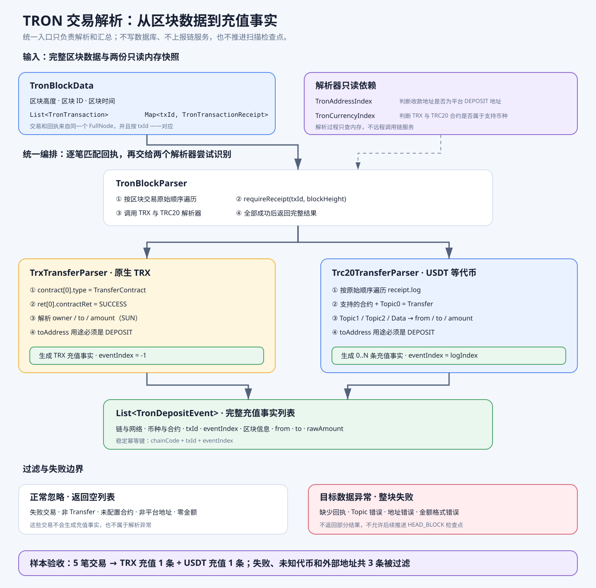

# TRON 交易解析图解

这张图说明 Scanner 如何把 FullNode 返回的区块、交易和回执，转换成统一的 `TronDepositEvent` 充值事实。



## 一、统一输入和输出

`TronNodeClient` 从同一个 FullNode 读取区块交易和执行回执，组合成 `TronBlockData`：

```text
区块头 + List<TronTransaction> + Map<txId, TronTransactionReceipt>
```

`TronBlockParser` 按交易原始顺序逐笔匹配回执，再调用 TRX 和 TRC20 解析器。整个区块全部解析成功后，才返回完整的 `List<TronDepositEvent>`。

## 二、为什么一笔交易会调用两个解析器

统一入口不提前判断充值类型，由两个解析器分别尝试识别：

```text
一笔链上交易
├─ TrxTransferParser：是否为 TRX TransferContract
└─ Trc20TransferParser：回执中是否存在受支持币种的 Transfer 日志
```

不属于当前解析器负责的类型时返回空列表。因此普通 TRX 充值只由 TRX 解析器产出结果，USDT 充值只由 TRC20 解析器产出结果，不会重复生成充值事实。

## 三、两条解析分支

### TRX

1. 合约类型必须是 `TransferContract`。
2. 执行结果必须是 `SUCCESS`。
3. 解析付款地址、收款地址和 SUN 原始金额。
4. 收款地址必须是平台 `DEPOSIT` 地址。
5. `eventIndex` 固定为 `-1`。

### TRC20

1. 按回执原始顺序遍历 `log`。
2. 日志合约地址必须存在于币种配置快照。
3. `Topic0` 必须是标准 `Transfer(address,address,uint256)` 事件签名。
4. 从 Topic1、Topic2 和 Data 解析付款地址、收款地址和原始金额。
5. 收款地址必须是平台 `DEPOSIT` 地址。
6. 使用原始日志下标作为 `eventIndex`，一笔交易可以生成多条充值事实。

## 四、过滤与失败规则

以下情况正常忽略：

- 交易明确失败。
- 非 TRX TransferContract。
- 非 Transfer 日志。
- 未配置的 TRC20 合约。
- 收款地址不是平台充值地址。
- 转账金额为零。

已经识别为目标转账后，如果地址、Topic、金额或回执结构不合法，则终止整个区块解析。Scanner 不返回部分结果，也不推进扫描检查点。

## 五、充值事实和幂等键

解析结果只表达“Scanner 在某个区块发现了一笔链上充值”，不代表交易已经固化到账。

```text
chainCode + chainNetwork + txId + eventIndex
```

这是充值事实的稳定幂等键。TRX 使用负数事件序号，TRC20 使用非负日志序号，两者不会冲突。

## 六、样本验收结果

阶段 5 使用五笔固定交易样本串联 `TronNodeClient → TronBlockParser → 两类解析器`：

| 样本 | 验收结果 |
|---|---|
| TRX 转入平台地址 | 生成一条 TRX 充值事实 |
| USDT 转入平台地址 | 生成一条 USDT 充值事实 |
| 执行失败 | 忽略 |
| 未配置的代币合约 | 忽略 |
| 转入外部地址 | 忽略 |

同一区块重复解析得到完全相同的结果。
