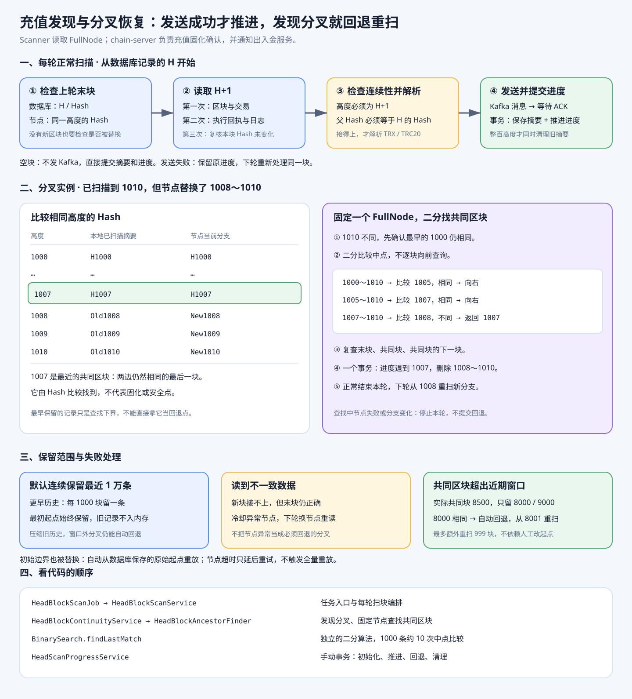

# 充值发现闭环与分叉恢复图解

先看这张图，再按下面的数据例子看代码。

## 一、正常扫块做什么

例如数据库记录已经扫描到 `1010 / H1010`：

1. 先向节点查询 1010，确认它仍然是 H1010。
2. 读取 1011 的区块和执行回执，再次核对 1011 的 Hash 没变。
3. 确认 1011 的父 Hash 是 H1010，再解析 TRX 和 TRC20 充值。
4. 有充值就发 Kafka 并等待 Broker ACK；空块直接进入下一步。
5. 一个手动事务保存 1011 摘要、将检查点推进到 1011。每到整百高度才同时清理旧摘要，1011 不触发清理。

每轮开始检查末块，是为了发现上一轮之后发生的分叉；每块检查父 Hash，是为了发现本轮扫块期间发生的分叉。

## 二、为什么读取区块要请求三次

| 次数 | 读取什么 | 作用 |
|---|---|---|
| 第一次 | 区块和交易列表 | 得到区块 Hash、普通 TRX 转账和合约调用内容 |
| 第二次 | 执行回执 | 从 Transfer 日志得到实际 TRC20 转账的付款方、收款方和数量 |
| 第三次 | 同一高度的区块 Hash | 检查前两次读取期间区块是否被替换 |

例如第一次读到 `1011 / A`，第三次读到 `1011 / B`，本次区块与回执都丢弃，由节点管理器整体重读。

三次都使用同一个 FullNode。Hash 复核可以检测读取期间可见的分支变化；充值最终是否有效，仍由 chain-server 固化确认。

## 三、发生分叉怎么恢复

本地已经扫描到 1010，最近的摘要与节点比较如下：

| 高度 | 本地 Hash | 节点 Hash | 是否相同 |
|---:|---|---|---|
| 1000～1007 | 原 Hash | 原 Hash | 相同 |
| 1008 | Old1008 | New1008 | 不同 |
| 1009 | Old1009 | New1009 | 不同 |
| 1010 | Old1010 | New1010 | 不同 |

处理顺序：

1. 固定一个 FullNode，在本地保留的摘要中二分查找。
2. 找到最后相同的 1007，复查末块、1007 和 1008。
3. 一个事务将检查点退到 1007，并删除 1008～1010 的旧摘要。
4. 本轮正常结束，不发送新分支充值。
5. 下轮从 1008 重扫，保存新 Hash，有充值则重新发送 Kafka。

`1007` 是最近的共同区块，由 Hash 比较找到。最早保留的摘要只是查找下界，不代表固化点。

已发送的旧分支消息不会从 Kafka 撤回。同一交易重新打包时可以再次发送；chain-server 通过幂等键和后续固化确认处理这些记录。

## 四、连续保留最近 2 万条摘要

`blockHistorySize` 默认 **20000**，每 100 个高度清理一次旧摘要。

例如扫描到 30000：保留 10001～30000。继续扫到 30099，暂时多保留 99 条；扫到 30100，再删除 10101 之前的记录。

| 处理 | 删除什么 |
|---|---|
| 正常清理 `pruneHistory` | 保留窗口之前的摘要 |
| 分叉回退 `rewind` | 共同区块之后的旧摘要，保留共同区块 |

**找不到共同区块：** 例如保留 80001～100000，共同区块是 79990，旧摘要已经删除。此时报错、保持原进度和摘要，不能猜回退位置或跳到最新高度。
2 万条是自动恢复的历史范围，不能保证任意深度分叉都自动恢复。

## 五、从哪里看代码

1. `scanBlocks()` 加载进度，通过 `checkResult.fork()` 分流。
2. 有分叉：`handleFork()` 查找共同区块，调用 `rewind()`，结束本轮。
3. 无分叉：`scanNewBlocks()` 先确定本轮范围，再逐块读取、检查父 Hash，交给 `processBlock()`。
4. `processBlock()` 解析充值、发送并等待 ACK，最后事务保存摘要和进度。

例如已扫 1000、节点到 1200、单次上限 100，本轮处理 1001～1100。
循环内父 Hash 接不上时交给 `handleParentHashMismatch()`：统一复查分叉，完成回退或冷却异常节点后结束本轮。

例如回退 1000 → 998：更新检查点为 998，删除 999、1000；998 已在摘要表中，不删除、不补写。两步 SQL 失败全部回滚，下轮从 999 重扫。

| 类 | 做什么 |
|---|---|
| `HeadBlockScanService` | 扫描入口和正常扫块 |
| `HeadBlockContinuityService` | 比较 Hash、组织分叉处理 |
| `HeadBlockAncestorFinder` | 固定节点，二分查找并复核共同区块 |
| `HeadScanProgressService` | 提交进度、事务回退、清理摘要 |

节点请求和 Kafka 发送在事务之外；Scanner 单实例、单任务、单机串行。

## 六、本轮测试结果

2026-10-06：完整测试 **183 项通过，0 失败**；3 项真实测试网验收因未配置节点而跳过。
验证了正常扫描、发送失败重发、轮内分叉、连续分叉、边界恢复、窗口外停止、重启重扫和事务回滚。
查找测试穷举 1000 条历史的全部 999 个分叉边界，同时验证 2 万条窗口的边界查找。

本轮采用受控 HTTP 节点、真实解析器、H2 MySQL 模式和手动事务，Kafka ACK 使用受控 Future。
详细场景见 [阶段 6 设计第 10 节](../阶段6-充值发现闭环设计.md#10-66-样本测试与图解)。
